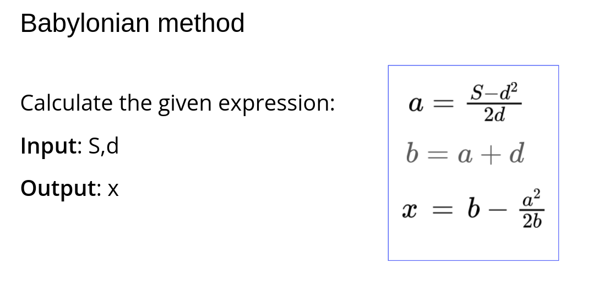

# Welcome
# Babylonian Method

Automated grading of homework assignments and tests
- fork this repository
- solve the task
- commit with proper message
- commit with proper message

# Condition
  

# Problems
## main

  Babyloniam method

**Example 1:**

```Python
Input: 16, 4
Output: 4.0

```

**Example 2:**

```Python
Input: 26, 5
Output: 5.099019607843137

```

# Warning
- don't copy other solutions or any solution
- don't remove comments
